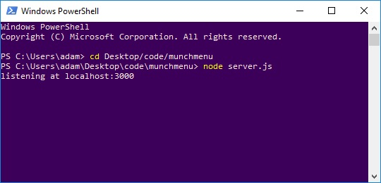

#Munch Thai Menu Editor

## Demo
<iframe width="560" height="315" src="https://www.youtube.com/embed/KrmT_pZFTAk" frameborder="0" allow="accelerometer; autoplay; encrypted-media; gyroscope; picture-in-picture" allowfullscreen></iframe>

## Installation
Project uses node server environment. If you haven't already, install [Node.js](https://nodejs.org/en/download/) 
- To verify installation type at command line: `node --version`
1. Download repository and unzip
2. Install dependencies:
   - Using Command Line (Win: cmd or powershell, Mac: terminal) navigate to application directory e.g. `cd downloads/munchmenu-master`
   - From within application directory, enter at command line: `npm i`  

## Using Application

#### To Run:
1. Start local server: 
   - From within application directory, enter at command line: `node server.js`
2. Navigate browser to [localhost:3000](localhost:3000)  

#### Getting Started:
1. Select a **source** from the dropdown:
   - Web: The current online published menu. Choose this when you first start editing
   - Local: Any changes made are saved to this local file. Choose this if you've already started making changes

2. Select a menu **tab** (page)
   - Section dropdown will populate with current sections

3. Select a menu **section**.
   - Forms to edit the section and items will load  
     
Dropdowns are disabled when changes have been made to forms. Save or undo changes to re-enable selection.

#### Features:

* **Preview**
  - Preview pane shows menu as formatted on website. Changes are updated live as you type. For image preview, image must already be uploaded to website to `/assets/images`
* **Add**
  - Click Add button. A new blank form will appear at the top of detailed items section. 
* **Delete**
  - Click trash icon at the bottom of item form to delete item. Click "OK" to confirm. 
* **Reorder**
  - Use up or down arrow athe bottom of item form to reorder items.
* **Undo**
  - Click Undo to discard changes made to current section forms. Does not affect any changes that were saved.
* **Save**
  - Save changes to local file `/munchmenu/publish/assets/js/menu.json` 
  - Once you have saved, you can select other tabs and sections without losing any changes
  - If you reload browser, choose "local" as the source to continue editing.

## Technologies Used
- [Node.js](https://nodejs.org) - Execute JavaScript outside of the browser
- [Express](https://www.npmjs.com/package/express) - Server framework for Node
- [Axios](https://www.npmjs.com/package/axios) - Server-side HTTP requests

## Author
**Adam Openbrier**
- [Portfolio](https://www.adamopenbrier.com)  
- [GitHub](https://github.com/aOpenbrier)  